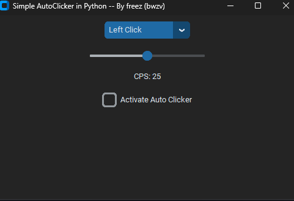

# Python-Auto-Clickers
Simple Python script made with CustomTkinter for an Auto Clicker by freez (bwzv).

## How to install it? ##
[⚠️] Bug Notice: Currently, only the left click works. The bug will be fixed tomorrow, and I will also add a keyboard auto-clicker.

Installation Steps: 

1: Clone the repository with Git: **-->** git clone https://github.com/freez000/Python-Auto-Clicker.git **-- Or --** on Windows, simply download the source code.

2: Install dependencies: **-->** pip install customtkinter pynput

3: Run the script: python auto_clicker **-- Or --** on Windows, double-click **run.bat** to launch the script.

# Example of the menu layout:

