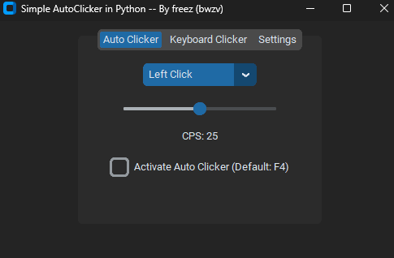

# Python Mouse and Keyboard Auto Clickers
Simple Python script made with CustomTkinter for an Auto Clicker by freez (bwzv).
Github: https://github.com/freez000/Python-Auto-Clicker

## How to install it? ##
Installation Steps:

1: Clone the repository with Git: **-->** git clone https://github.com/freez000/Python-Auto-Clicker.git **-- Or --** on Windows, simply download the source code.

2: Install dependencies: **-->** pip install customtkinter pynput keyboard

3: Run the script: python auto_clicker **-- Or --** on Windows, double-click **run.bat** to launch the script.

# Menu Layout:

